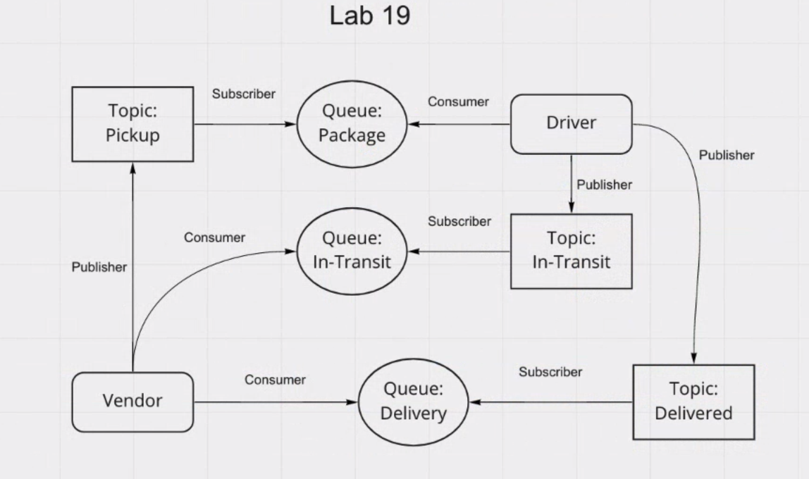

# AWS: Events

Created by Sarah Creager

## Summary of Problem Domain

Used AWS Services: SQS, SNS, Lambda, to create a cloud version of the CAPS system

## Operations

**Vendors:**

* Vendors will post “pickup” messages containing delivery information into the SNS pickup topic

* Pickup requests should be moved into a FIFO queue called packages for the drivers automatically

* Vendors should separately subscribe to their personal SQS queue and periodically poll the queue to see delivery notifications

**Drivers:**

* Drivers will poll the SQS packages queue and retrieve only the next delivery order (message)

* After a time (e.g. 5 seconds), drivers will post a message to the Vendor specific SQS Queue using the queueArn specified in the order object

## UML

*Mob programmed UML with Justin Hamerly and Antoine Charette*

